# 유스케이스 문서 양식

새 페이지는 위계에 맞춰 `src/content/docs/use-cases/` 아래 폴더 구조로 만든다.

- **말단(자식) 항목** → `<위계>.md` — 상세 다이어그램
- **하위를 가진 항목** → `<위계>/index.md` — 개요(요약) 다이어그램 + 자식 파일들

파일·폴더명은 **위계 번호**(예: `7-1-2.md`, `7-1/`)로 쓴다 — 배치·식별용. **문서 본문엔 번호를 표시하지 않는다**(표시 이름은 frontmatter `title`의 한국어 이름).

---

## 말단(자식) 양식

````markdown
---
title: <항목 이름>
description: ''
---

<!-- TODO: <항목 이름> — 한 줄 요약 -->

## 다이어그램

```plantuml
@startuml
left to right direction
skinparam packageStyle rectangle
' TODO: 유스케이스 작성
note "작성 예정" as TODO
@enduml
```



## 액터
<!-- Claude 초안 → 사용자 조정 -->

## 유스케이스 설명

| 유스케이스 | 설명 | 사전 조건 | 사후 조건 |
| --- | --- | --- | --- |
|  |  |  |  |

## SRS 사전 정리
<!-- 유스케이스는 명확하나 SRS 구현 시 참고할 요구사항·결정 필요 사항 -->

## 추후 논의 필요
<!-- 유스케이스 자체의 모호함 / 논의 사항 (없으면 비움) -->
````

---

## 부모(개요) 양식

````markdown
---
title: <항목 이름>
description: ''
---

<!-- TODO: <항목 이름> 개요 -->

## 개요 다이어그램
<!-- 직속 자식들을 요약 유스케이스(오발 1개)로. 부모=지도, 자식=상세 -->


## 하위 항목
- <자식 1>
- <자식 2>

## SRS 사전 정리
<!-- SRS 구현 시 참고할 요구사항·결정 필요 사항 -->

## 추후 논의 필요
<!-- 유스케이스 자체의 모호함 / 논의 사항 -->
````
