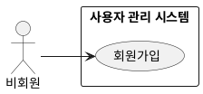

## 개요
비회원이 정보를 입력해 계정을 만드는 기능이다.

## 요구사항
1. 비회원은 정보를 입력해 회원가입을 할 수 있다.
2. 가입 과정에서 입력값이 올바른지(필수 항목과 형식) 확인하고, 아이디나 이메일이 이미 쓰이는지 중복을 확인한다.
3. 위 과정을 통과하면 계정이 만들어진다.

## 유스케이스 다이어그램

```plantuml
@startuml
left to right direction
skinparam packageStyle rectangle
skinparam shadowing false

actor "비회원" as Guest

rectangle "사용자 관리 시스템" {
  usecase "회원가입" as Register
}

Guest --> Register
@enduml
```
