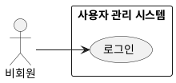

## 개요
계정이 있는 사용자가 로그인 정보를 확인받아 로그인하는 기능이다. 로그인하면 인증된 세션이 시작된다.

## 요구사항
1. 아직 로그인하지 않은 사용자는 자신의 로그인 정보(예: 아이디와 비밀번호)를 입력해 로그인할 수 있다.
2. 입력한 정보가 맞는지 확인하고, 맞으면 로그인 상태(인증 세션)가 된다. 맞지 않으면 실패 이유를 안내한다.
3. 이렇게 시작된 세션은 로그아웃 전까지 유지되며, 로그인이 필요한 기능은 이 세션을 확인해 접근을 허용한다.

## 유스케이스 다이어그램

