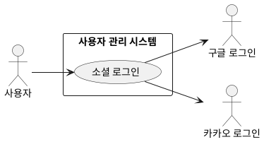

## 개요
회원이 구글 또는 카카오 계정으로 로그인하는 기능이다. 처음 로그인하면 계정이 자동으로 만들어지고, 이후로는 같은 소셜 계정으로 로그인한다. 별도의 회원가입 절차나 비밀번호는 없다. 인증은 OAuth 2.0 인가 코드 흐름을 따른다.

## 요구사항
이 페이지의 요구사항은 **UC-LOGIN-01**(소셜 로그인)을 실현한다.

### 로그인 시작
| ID | 요구사항 |
| --- | --- |
| FR-LOGIN-01 | 회원은 구글 또는 카카오 계정으로 로그인할 수 있다. |
| FR-LOGIN-02 | 로그인을 시작하면 시스템은 선택한 제공자의 인증 화면으로 보내 인증과 정보 제공 동의를 받는다. 이때 위조 요청을 막기 위한 상태값(state)을 함께 전달한다. |

### 인증 처리
| ID | 요구사항 |
| --- | --- |
| FR-LOGIN-03 | 제공자 인증을 마치면 시스템은 콜백으로 돌아온 상태값을 검증하고, 인가 코드를 제공자와 교환해 사용자 정보를 받는다. 상태값이 일치하지 않으면 요청을 거부한다. |
| FR-LOGIN-04 | 시스템은 사용자를 "제공자 + 제공자 고유 ID" 조합으로 식별한다. |

### 계정 생성과 세션
| ID | 요구사항 |
| --- | --- |
| FR-LOGIN-05 | 해당 식별자로 만든 계정이 없으면 시스템은 새 계정을 자동으로 생성한다(첫 로그인이 곧 가입이다). 이미 있으면 그 계정으로 로그인한다. |
| FR-LOGIN-06 | 로그인이 끝나면 시스템은 인증 세션을 시작하고, 이후 로그인이 필요한 기능은 이 세션을 확인해 접근을 허용한다. |

### 실패 처리
| ID | 요구사항 |
| --- | --- |
| FR-LOGIN-07 | 사용자가 제공자 화면에서 동의를 취소하거나 인증에 실패하면 로그인을 중단하고 사유를 안내한다. |

### 비기능 요구사항
| ID | 항목 | 요구사항 |
| --- | --- | --- |
| NFR-LOGIN-01 | 보안 | 인증 과정의 모든 통신은 전송 구간에서 암호화하며, 상태값(state) 검증으로 위조 요청(CSRF)을 막는다. |
| NFR-LOGIN-02 | 외부 의존 | 로그인은 외부 제공자(구글·카카오)에 의존한다. 제공자 장애나 응답 실패 시 로그인할 수 없으며, 이를 사용자에게 안내한다. |
| NFR-LOGIN-03 | 세션 | 인증 세션은 로그아웃하거나 정해진 유효 기간이 지나면 만료된다. |
| NFR-LOGIN-04 | 최소 수집 | 제공자로부터 서비스에 필요한 최소한의 정보만 받는다. |

## 데이터
계정(사용자 레코드)은 다음을 가진다.

| 항목 | 설명 |
| --- | --- |
| 식별자 | 계정 고유 ID |
| 제공자 | google / kakao |
| 제공자 고유 ID | 제공자가 부여한 사용자 식별자 (제공자와 함께 유일) |
| 닉네임 | 표시 이름 (제공자 프로필에서 가져오거나 회원이 정함) |
| 가입 시각 | 첫 로그인 시점 |

인증 세션은 로그인한 회원, 발급 시각, 만료 시각을 가지며 로그아웃 또는 만료 시 무효화된다.

## 외부 인터페이스
- **구글 로그인 (외부, 2차 액터)**: OAuth 2.0으로 인증과 사용자 정보를 제공한다.
- **카카오 로그인 (외부, 2차 액터)**: OAuth 2.0으로 인증과 사용자 정보를 제공한다.

## 유스케이스 다이어그램

