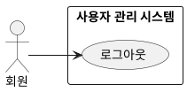

## 개요
로그인한 회원이 현재 인증 세션을 끝내는 기능이다.

## 요구사항
이 페이지의 요구사항은 **UC-LOGOUT-01**(로그아웃)을 실현한다.

### 로그아웃
| ID | 요구사항 |
| --- | --- |
| FR-LOGOUT-01 | 회원은 로그아웃할 수 있다. |
| FR-LOGOUT-02 | 로그아웃하면 시스템은 현재 인증 세션을 무효화한다. |
| FR-LOGOUT-03 | 로그아웃 이후에는 로그인이 필요한 기능에 다시 접근할 수 없다. |

### 비기능 요구사항
| ID | 항목 | 요구사항 |
| --- | --- | --- |
| NFR-LOGOUT-01 | 세션 | 무효화된 세션으로는 보호 자원에 접근할 수 없다. |

## 데이터
로그아웃은 [로그인](/closet-fairy-diagrams/use-cases/2/2-2)에서 만든 인증 세션을 무효화한다. 별도의 데이터는 만들지 않는다.

## 유스케이스 다이어그램

