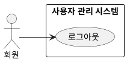

## 개요
로그인한 회원이 현재 로그인 상태를 끝내는 기능이다.

## 요구사항
1. 회원은 로그아웃할 수 있다.
2. 로그아웃하면 현재 로그인 상태(세션)가 풀린다.

## 유스케이스 다이어그램

```plantuml
@startuml
left to right direction
skinparam packageStyle rectangle
skinparam shadowing false

actor "회원" as Member

rectangle "사용자 관리 시스템" {
  usecase "로그아웃" as Logout
}

Member --> Logout
@enduml
```
