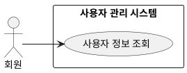

## 개요
로그인한 회원이 자신의 계정 정보를 조회하는 기능이다.

## 요구사항
이 페이지의 요구사항은 **UC-AVIEW-01**(사용자 정보 조회)을 실현한다.

### 조회
| ID | 요구사항 |
| --- | --- |
| FR-AVIEW-01 | 회원은 자신의 계정 정보를 조회할 수 있다. |
| FR-AVIEW-02 | 시스템은 인증 세션으로 본인 여부를 확인한 뒤 정보를 제공한다. |
| FR-AVIEW-03 | 조회 화면에는 닉네임, 연결된 소셜 제공자(구글·카카오), 가입일 등 계정 정보를 표시한다. |
| FR-AVIEW-04 | 회원은 다른 회원의 계정 정보를 조회할 수 없다. |

### 비기능 요구사항
| ID | 항목 | 요구사항 |
| --- | --- | --- |
| NFR-AVIEW-01 | 접근 권한 | 회원은 자신의 정보만 조회할 수 있다. |

## 데이터
조회는 [소셜 로그인](/closet-fairy-diagrams/use-cases/2/2-2)에서 만든 계정 레코드를 읽어 표시한다.

## 유스케이스 다이어그램

