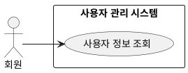

## 개요
로그인한 회원이 자신의 계정 정보를 보는 기능이다.

## 요구사항
1. 회원은 자신의 계정 정보를 볼 수 있다.
2. 정보를 보여 주기 전에 본인이 맞는지 확인한다.

## 유스케이스 다이어그램

```plantuml
@startuml
left to right direction
skinparam packageStyle rectangle
skinparam shadowing false

actor "회원" as Member

rectangle "사용자 관리 시스템" {
  usecase "사용자 정보 조회" as View
}

Member --> View
@enduml
```
