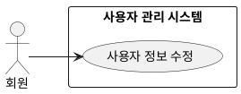

## 개요
로그인한 회원이 자신의 프로필 정보를 수정하거나 계정을 탈퇴하는 기능이다. 로그인은 소셜 계정으로 하므로 비밀번호는 다루지 않는다.

## 요구사항
이 페이지의 요구사항은 **UC-AEDIT-01**(사용자 정보 수정)을 실현한다.

### 프로필 수정
| ID | 요구사항 |
| --- | --- |
| FR-AEDIT-01 | 회원은 자신의 프로필 정보(예: 닉네임)를 수정할 수 있다. |
| FR-AEDIT-02 | 시스템은 수정 입력값의 필수 여부와 형식을 검증하고, 위반 시 안내한다. |

### 계정 탈퇴
| ID | 요구사항 |
| --- | --- |
| FR-AEDIT-03 | 회원은 계정을 탈퇴할 수 있다. 탈퇴 전 시스템은 본인 확인을 거친다. |
| FR-AEDIT-04 | 탈퇴하면 시스템은 계정과 개인정보를 관련 규정에 따라 파기하고, 소셜 제공자와의 연결을 해제한다. |

### 비기능 요구사항
| ID | 항목 | 요구사항 |
| --- | --- | --- |
| NFR-AEDIT-01 | 접근 권한 | 회원은 자신의 정보만 수정하거나 탈퇴할 수 있다. |
| NFR-AEDIT-02 | 보안 | 탈퇴 같은 민감한 변경은 본인 재확인을 거친다. |

## 데이터
수정은 [소셜 로그인](/closet-fairy-diagrams/use-cases/2/2-2)의 계정 레코드에서 닉네임 등을 갱신하거나, 탈퇴 시 계정을 파기한다.

## 유스케이스 다이어그램

