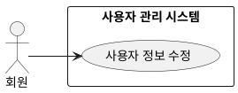

## 개요
로그인한 회원이 자신의 계정 정보를 수정하는 기능이다. 비밀번호 변경도 여기에 포함된다.

## 요구사항
1. 회원은 자신의 계정 정보를 수정할 수 있다. 비밀번호 변경도 이 기능으로 한다.
2. 수정 과정에서 본인이 맞는지 확인하고, 입력값이 올바른지 검증한다.

## 유스케이스 다이어그램

```plantuml
@startuml
left to right direction
skinparam packageStyle rectangle
skinparam shadowing false

actor "회원" as Member

rectangle "사용자 관리 시스템" {
  usecase "사용자 정보 수정" as Update
}

Member --> Update
@enduml
```
