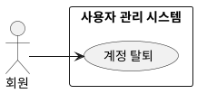

## 개요
로그인한 회원이 자신의 계정을 없애는 기능이다. 되돌릴 수 없는 행위라 실행 전에 본인 확인을 거치며, 계정과 개인정보를 파기하고 소셜 제공자와의 연결도 끊는다.

## 요구사항
이 페이지의 요구사항은 **UC-WITHDRAW-01**(계정 탈퇴)을 실현한다.

### 탈퇴
| ID | 요구사항 |
| --- | --- |
| FR-WITHDRAW-01 | 회원은 자신의 계정을 탈퇴할 수 있다. |
| FR-WITHDRAW-02 | 탈퇴를 실행하기 전에 시스템은 본인 확인을 거친다. |
| FR-WITHDRAW-03 | 탈퇴하면 시스템은 계정과 개인정보를 관련 규정에 따라 파기하고, 소셜 제공자와의 연결을 해제한다. |
| FR-WITHDRAW-04 | 탈퇴는 되돌릴 수 없으며, 시스템은 실행 전에 이 사실을 회원에게 알린다. |

### 비기능 요구사항
| ID | 항목 | 요구사항 |
| --- | --- | --- |
| NFR-WITHDRAW-01 | 접근 권한 | 회원은 자신의 계정만 탈퇴할 수 있다. |
| NFR-WITHDRAW-02 | 보안 | 되돌릴 수 없는 행위이므로 본인 재확인을 거친다. |

## 데이터
탈퇴 시 [소셜 로그인](/closet-fairy-diagrams/use-cases/2/2-2)의 계정 레코드와 함께, 회원이 등록한 옷 이미지·속성과 선호 데이터를 파기한다.

## 유스케이스 다이어그램

