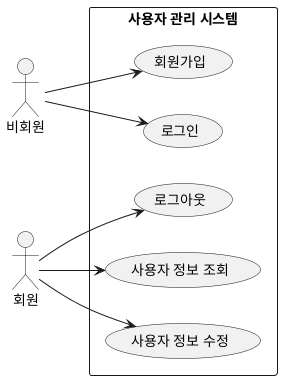

## 개요
회원 계정을 만들고, 로그인하고, 자신의 정보를 관리하는 영역이다. 아래 기능들의 요약이며 자세한 내용은 각 하위 페이지에 있다.

## 요구사항
이 영역은 다음 기능으로 이루어진다. 세부 요구사항은 각 하위 페이지에 적는다.

- 회원가입: [회원가입 기능](/use-cases/2/2-1)
- 로그인: [로그인 기능](/use-cases/2/2-2)
- 로그아웃: [로그아웃 기능](/use-cases/2/2-3)
- 사용자 정보 조회: [사용자 정보 조회](/use-cases/2/2-5)
- 사용자 정보 수정: [사용자 정보 수정](/use-cases/2/2-6)

로그인하면 인증된 세션이 유지되고, 로그인이 필요한 기능은 그 세션을 확인한다.

## 유스케이스 다이어그램

## 정해야 하는 논의사항
회원가입과 로그인 방식이 아직 정해지지 않았다. 가입할 때 사용자에게서 어떤 정보를 받을지, 그리고 로그인을 자체 계정으로 할지 아니면 네이버나 구글 같은 외부 계정 연동으로 할지를 정해야 한다.
