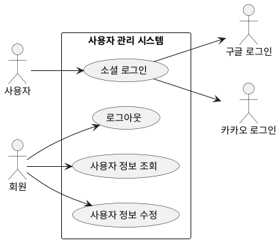

## 개요
회원이 소셜 로그인으로 계정을 만들고 로그인하며, 자신의 정보를 관리하는 영역이다. 로그인은 구글·카카오 소셜 로그인만 지원하고, 시스템은 비밀번호를 직접 다루지 않는다.

## 요구사항
이 영역은 다음 기능으로 이루어진다. 세부 요구사항은 각 하위 페이지에 적는다.

- 소셜 로그인(가입 겸): [소셜 로그인](/closet-fairy-diagrams/use-cases/2/2-2)
- 로그아웃: [로그아웃 기능](/closet-fairy-diagrams/use-cases/2/2-3)
- 사용자 정보 조회: [사용자 정보 조회](/closet-fairy-diagrams/use-cases/2/2-5)
- 사용자 정보 수정: [사용자 정보 수정](/closet-fairy-diagrams/use-cases/2/2-6)

로그인은 구글·카카오 계정으로 하며, 사용자는 "제공자 + 제공자 고유 ID"로 식별한다. 첫 소셜 로그인 시 계정이 자동으로 생성된다. 로그인하면 인증된 세션이 유지되고, 로그인이 필요한 기능은 그 세션을 확인한다.

## 유스케이스 다이어그램

