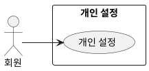

## 개요
회원이 설정 페이지에서 자신의 정보와 취향을 설정하는 기능이다.

## 요구사항
1. 회원은 다음 항목을 설정하고 저장할 수 있다.
   - 체질: 추위와 더위에 얼마나 민감한지
   - 연령대
   - 성별
   - 선호 스타일: 여러 개를 고를 수 있다
2. 설정한 값은 저장되어 추천 등 다른 기능에 반영된다.

## 유스케이스 다이어그램

