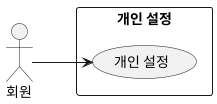

## 개요
회원이 자신의 취향 정보를 설정하는 기능이다. 여기서 설정한 값은 코디 추천 등 이를 사용하는 기능에 반영된다.

## 요구사항
이 페이지의 요구사항은 **UC-PREF-01**(개인 설정)을 실현한다.

### 설정 항목
| ID | 요구사항 |
| --- | --- |
| FR-PREF-01 | 회원은 체질(추위·더위 민감도), 연령대, 성별, 선호 스타일을 설정할 수 있다. |
| FR-PREF-02 | 선호 스타일은 여러 개를 고를 수 있다. |
| FR-PREF-03 | 시스템은 설정 입력값이 정해진 선택지 범위에 드는지 검증한다. |

### 저장과 반영
| ID | 요구사항 |
| --- | --- |
| FR-PREF-04 | 설정한 값은 저장되고, 회원은 언제든 다시 수정할 수 있다. |
| FR-PREF-05 | 저장한 설정은 [코디 추천 받기](/closet-fairy-diagrams/use-cases/6/6-1) 등 이를 사용하는 기능에 반영된다. |
| FR-PREF-06 | 아직 설정하지 않은 항목은 비어 있는 것으로 두고, 이를 사용하는 기능은 값이 없는 것으로 처리한다. |

### 비기능 요구사항
| ID | 항목 | 요구사항 |
| --- | --- | --- |
| NFR-PREF-01 | 접근 권한 | 회원은 자신의 설정만 조회하고 변경할 수 있다. |

## 데이터
- **개인 설정**: 체질(추위·더위 민감도), 연령대, 성별, 선호 스타일(다중). 회원 계정에 연결된다.

## 유스케이스 다이어그램

