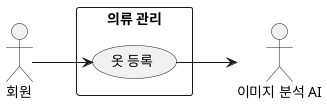
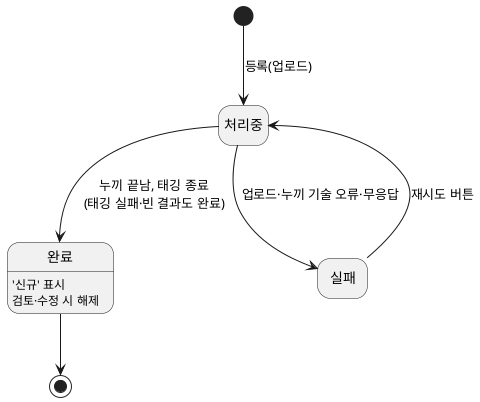
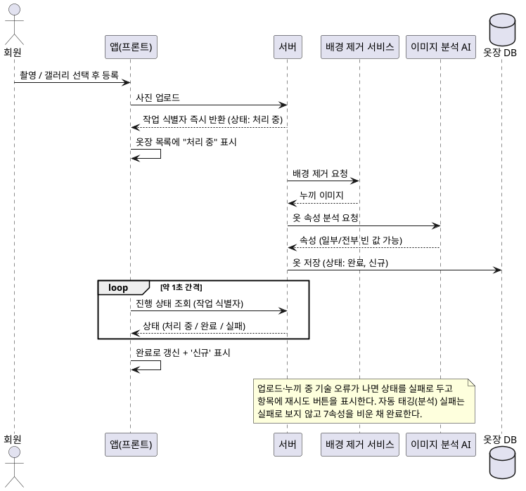

## 개요
회원이 자신의 옷 사진을 옷장에 추가하는 기능이다. 회원이 옷을 촬영하거나 갤러리에서 여러 장을 골라 올리면, 시스템은 업로드, 배경 제거(누끼), 자동 태깅을 비동기로 처리한다. 회원은 처리가 끝나길 기다리지 않고 계속 옷을 올릴 수 있으며, 각 옷은 옷장 목록에 곧바로 나타나 처리 상태(처리 중 / 완료 / 실패)를 보여 준다. 배경 제거는 시스템 내부 보조 서비스가, 자동 태깅은 외부 이미지 분석 AI가 맡는다.

옷장 목록의 화면 표시는 [의류 목록 조회](/closet-fairy-diagrams/use-cases/5/5-4), 자동 태깅 결과의 확인·수정은 [의류 수정](/closet-fairy-diagrams/use-cases/5/5-2)에서 다룬다. 이미지 분석 AI가 추출하는 속성의 종류와 분석 동작의 세부는 자동 태깅 명세를 따른다.

## 요구사항
이 페이지의 요구사항은 **UC-REG-01**(옷 등록)을 실현한다.

### 사진 입력
| ID | 요구사항 |
| --- | --- |
| FR-REG-01 | 회원은 카메라로 옷을 한 장씩 촬영하여 등록할 수 있다. |
| FR-REG-02 | 회원은 갤러리에서 여러 장의 사진을 한 번에 선택하여 등록할 수 있다. |
| FR-REG-03 | 사진 한 장은 옷 한 벌에 대응한다. |
| FR-REG-04 | 아이폰 촬영 형식(HEIC/HEIF)으로 올라온 사진은 서버에서 투명 채널을 보존하는 웹 형식(PNG 또는 WEBP)으로 변환한 뒤 저장·표시한다. 변환에 실패하면 업로드 단계 기술 오류로 보고 실패 처리한다(FR-REG-22). |

### 등록 조작
| ID | 요구사항 |
| --- | --- |
| FR-REG-05 | 회원은 촬영하거나 선택한 사진마다 등록할지 버릴지 정할 수 있고, 버린 사진은 업로드하지 않는다. |
| FR-REG-06 | 촬영 등록 중 회원은 계속 촬영할지 끝낼지 정할 수 있으며, 계속을 고르면 곧바로 다음 옷을 촬영할 수 있다. |
| FR-REG-07 | 회원은 진행 중인 처리가 끝나기를 기다리지 않고 곧바로 다음 옷을 등록할 수 있다. |
| FR-REG-08 | 검증을 통과해 업로드된 옷은 즉시 옷장 목록에 "처리 중" 상태로 나타난다. |

### 비동기 처리
| ID | 요구사항 |
| --- | --- |
| FR-REG-09 | 시스템은 등록 요청을 받으면 작업마다 고유한 작업 식별자를 즉시 발급하여 회원 화면에 돌려준다. |
| FR-REG-10 | 시스템은 처리 작업을 대기열에 쌓고, 한 번에 동시 처리 한도까지만 처리하며, 한도를 넘는 작업은 순서대로 대기한다. 동시 처리 한도는 운영 설정값으로 두어 코드 변경 없이 조정한다. |
| FR-REG-11 | 처리는 두 단계다. 1단계 배경 제거(누끼)는 보조 서비스가, 2단계 자동 태깅은 외부 이미지 분석 AI가 수행한다. 자동 태깅에는 배경을 제거한 누끼 이미지를 전달한다. |
| FR-REG-12 | 처리는 비동기로 진행되며, 회원이 앱을 벗어나거나 화면을 꺼도 서버에서 계속 진행된다. |

### 상태와 진행 표시
| ID | 요구사항 |
| --- | --- |
| FR-REG-13 | 각 옷은 처리 중 / 완료 / 실패 중 하나의 상태를 가진다. |
| FR-REG-14 | 회원 화면은 약 1초 간격으로 진행 상태를 조회하여, 끝난 작업부터 상태를 갱신한다. 처리 중인 옷이 하나도 없으면 조회를 멈추고, 새 등록·재시도로 처리 중인 옷이 다시 생기면 재개한다. 조회 요청이 실패하면 이전 상태를 유지하고 다음 주기에 다시 조회한다. |
| FR-REG-15 | 처리 중인 옷은 편집할 수 없다. |
| FR-REG-16 | 처리가 완료된 옷에는 회원이 아직 검토하지 않았음을 알리는 "신규" 표시를 붙이며, 회원이 그 옷의 항목을 열어 보면 표시가 사라진다. |

### 자동 태깅 속성
| ID | 요구사항 |
| --- | --- |
| FR-REG-17 | 자동 태깅 대상은 7개 속성이다: category(분류), item_name(옷 이름), color(색상), style(스타일), season(계절), thickness(두께), is_waterproof(방수 여부). |
| FR-REG-18 | 이미지 분석 AI는 인식에 실패하지 않는 한 앞 3개 속성(category, item_name, color)을 반드시 채워야 하고, 뒤 4개 속성(style, season, thickness, is_waterproof)은 가능한 경우 채운다. 이 조건은 이미지 분석 AI가 지켜야 하는 것이며, 시스템은 받은 결과를 그대로 저장한다. 앞 3개가 비어 오더라도 다시 요청하지 않고 FR-REG-20에 따라 빈 채로 완료한다. |

속성별 허용 값은 다음과 같다.

| 속성 | 값 | 여러 개 선택 |
| --- | --- | --- |
| category (분류) | outer, top, bottom, shoes, socks, accessories 중 하나 | 아니오 |
| item_name (옷 이름) | 자유 입력 | 아니오 |
| color (색상) | 자유 입력 | 아니오 |
| style (스타일) | minimal, casual, street, classic, formal, sporty, romantic, vintage, bohemian, preppy, chic, unique | 예 |
| season (계절) | spring, summer, fall, winter 중 하나 | 아니오 |
| thickness (두께) | thin, medium, thick 중 하나 | 아니오 |
| is_waterproof (방수 여부) | 예 / 아니오 | 아니오 |

위 표는 각 속성이 가질 수 있는 값의 종류다. 앞 3개(category, item_name, color)를 반드시 채워야 한다는 것은 `FR-REG-18`에 따라 이미지 분석 AI가 지킬 조건이며, 저장된 옷의 속성은 비어 있을 수 있다. 태깅이 실패하면 모두 빈 채로 저장되고(FR-REG-20), 회원은 AI가 채운 값도 지우고 저장할 수 있다([의류 수정](/closet-fairy-diagrams/use-cases/5/5-2) FR-EDIT-08). 이 값 목록은 사용 경험과 자동 태깅 정확도를 보며 조정할 수 있다.

### 자동 태깅 결과 저장
| ID | 요구사항 |
| --- | --- |
| FR-REG-19 | 자동 태깅이 끝나면 시스템은 채워진 속성을 옷 정보에 저장하고 상태를 완료로 바꾼다. 완료 저장은 대상 레코드가 존재하고 취소되지 않은 경우에만 원자적으로 수행하며, 대상이 삭제·취소됐으면 결과와 그 사이 만든 산출물(누끼 이미지 등)을 폐기한다. |
| FR-REG-20 | 이미지 업로드·배경 제거와 달리, 자동 태깅은 기술적으로 실패하거나 옷을 인식하지 못하거나 최대 대기 시간을 넘겨도 실패로 처리하지 않는다(graceful). 이 경우 시스템은 7개 속성을 모두 비운 채로 저장하여 완료한다. 일부 속성만 찾은 경우에는 찾은 것만 채운다. |
| FR-REG-21 | 자동 태깅으로 비어 있는 속성은 회원이 [의류 수정](/closet-fairy-diagrams/use-cases/5/5-2)에서 채운다. |

### 실패와 재시도
| ID | 요구사항 |
| --- | --- |
| FR-REG-22 | 업로드 또는 배경 제거(누끼) 처리 중 기술적 오류(통신 오류, 보조 서비스 오류 등)가 나거나 최대 대기 시간을 넘겨도 응답이 없으면 해당 옷의 상태를 실패로 둔다. 자동 태깅 단계의 실패·무응답은 실패로 보지 않는다(FR-REG-20). |
| FR-REG-23 | 실패는 알림 창을 띄우지 않고, 옷장 목록의 해당 옷 항목에 재시도 버튼을 표시하는 방식으로 알린다. |
| FR-REG-24 | 회원이 재시도 버튼을 누르면 시스템은 그 옷의 처리를 처음(업로드 이후 단계)부터 다시 수행한다. 재시도 시 새 작업 식별자를 발급해 회원 화면에 돌려주며, 이후 폴링은 새 식별자로 조회한다. |
| FR-REG-25 | 한 옷의 실패는 다른 옷의 처리에 영향을 주지 않는다. |

### 비기능 요구사항
| ID | 항목 | 요구사항 |
| --- | --- | --- |
| NFR-REG-01 | 응답성 | 시스템은 처리 완료를 기다리지 않고 등록 즉시 작업 식별자를 돌려주어, 회원이 곧바로 다음 등록을 이어갈 수 있게 한다. |
| NFR-REG-02 | 비동기 지속성 | 회원의 화면 상태(앱 종료, 화면 꺼짐, 네트워크 일시 끊김)와 무관하게 서버는 등록 처리를 끝까지 진행한다. |
| NFR-REG-03 | 동시성 | 시스템은 동시 처리 한도를 두어 대기열의 작업을 한 번에 그 한도만큼만 처리한다. 한도 값은 운영 설정값으로 둔다. |
| NFR-REG-04 | 진행 표시 주기 | 처리 진행 상태 조회 간격은 약 1초로 한다. |
| NFR-REG-05 | 이미지 제약 | 업로드 가능한 형식은 JPG(.jpg, .jpeg), PNG(.png), WEBP(.webp), HEIC/HEIF이며, 한 장당 최대 용량은 20MB다. 형식이나 용량을 벗어난 파일은 업로드 단계에서 거르고 목록에 카드로 만들지 않는다. 여러 장을 한 번에 선택한 경우 통과한 파일은 정상 등록하고 통과하지 못한 파일만 제외하며, 제외된 파일이 있으면 회원에게 알리고 회원이 제외된 각 파일의 파일명과 사유를 확인할 수 있게 한다. |
| NFR-REG-06 | 실패 격리 | 각 옷은 독립적으로 처리·재시도되며, 한 작업의 실패가 전체 등록을 막지 않는다. |
| NFR-REG-07 | 접근 권한 | 의류 등록은 로그인한 회원만 사용할 수 있다. |
| NFR-REG-08 | 처리 대기 시간 | 배경 제거(누끼)와 자동 태깅 각 단계에 최대 대기 시간을 둔다. 시간을 넘기면 누끼 단계는 실패로(FR-REG-22), 자동 태깅 단계는 빈 값 완료로(FR-REG-20) 처리한다. 구체 값은 운영 설정값으로 두어 코드 변경 없이 조정한다. |
| NFR-REG-09 | 처리 내구성 | 서버가 예기치 않게 멈췄다가 다시 시작해도 처리 중이던 작업은 유실되지 않고 이어서 처리하거나 복구한다. |

## 데이터
옷 한 벌(의류 레코드)은 다음을 가진다.

| 항목 | 설명 |
| --- | --- |
| 식별자 | 옷 고유 ID |
| 소유 회원 | 등록한 회원 |
| 작업 식별자 | 비동기 처리 추적용 |
| 처리 상태 | 처리 중 / 완료 / 실패 |
| 검토 표시 | 신규 여부 |
| 원본 이미지 | 회원이 올린 사진 |
| 누끼 이미지 | 배경을 제거한 사진 |
| 태깅 속성 (7개) | category, item_name, color, style, season, thickness, is_waterproof (자동 태깅으로 채워지며 비어 있을 수 있다) |
| 등록 시각 | 등록한 시점 |

## 외부 인터페이스
- **이미지 분석 AI (외부, 2차 액터)**: 시스템이 옷 이미지를 보내면 분석된 속성을 돌려준다. 응답 지연·오류·인식 실패 시에도 등록을 실패로 처리하지 않고, 7개 속성을 비운 채 완료한다(FR-REG-20).
- 배경 제거 보조 서비스는 시스템 내부 구성요소이며 외부 인터페이스가 아니다.

## 유스케이스 다이어그램

## 상태 모델

## 처리 흐름

