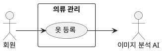

## 개요
회원이 옷을 옷장에 등록하는 기능이다. 촬영하거나 갤러리에서 가져온 옷 사진을 등록하면, 서버가 업로드와 배경 제거(누끼), 자동 태깅을 비동기로 처리한다. 회원은 처리가 끝나길 기다리지 않고 계속 등록할 수 있다.

## 요구사항

### 회원이 하는 촬영·등록 조작
1. 회원은 옷을 한 장씩 촬영해 등록할 수 있다.
2. 찍은 사진마다 등록할지 버릴지, 그리고 계속 찍을지 끝낼지 정한다. 계속을 고르면 곧바로 다음 옷을 촬영할 수 있다.
3. 등록한 옷은 처리를 기다리지 않아도 되고, 옷장 목록에 곧바로 "처리 중" 상태로 나타난다. (목록과 상태 표시는 [의류 목록 조회](/closet-fairy-diagrams/use-cases/5/5-4)에서 다룬다.)
4. 버린 사진은 올리지 않고 버린다.

### 서버의 비동기 처리
5. 등록한 사진은 서버로 올라간다. 서버는 작업마다 고유 번호를 즉시 돌려주고, 처리는 대기열에 쌓아 한 번에 정해진 수만큼만 처리한다.
6. 처리는 두 단계다. 배경 제거(누끼)는 ONNX 형식의 AI 모델을 쓰는 별도 보조 서비스가 맡고, 자동 태깅은 외부 이미지 분석 AI가 옷 속성을 분석한다.
7. 처리는 비동기여서 회원이 앱을 벗어나거나 화면을 꺼도 서버에서 계속된다.
8. 진행 상황은 회원 화면이 약 1초마다 서버에 물어보는 방식으로 확인하고, 끝난 작업부터 결과가 목록에 반영된다("처리 중"에서 "완료"로).
9. 자동으로 붙인 속성의 저장 방침과 회원 확인·수정은 [의류 수정](/closet-fairy-diagrams/use-cases/5/5-2/)에서 다룬다.

## 유스케이스 다이어그램

## 정해야 하는 논의사항
등록 처리가 실패했을 때 이를 어떻게 다룰지 정해야 한다. 실패한 옷을 다시 등록하도록 재시도를 제공할지도 함께 결정해야 한다.
