## 개요
회원이 등록된 옷을 수정하는 기능이다. 이미지를 다듬거나 속성을 고친다.

## 요구사항
1. 회원은 등록된 옷을 골라 수정할 수 있다.
2. **이미지 편집**: 브러시로 특정 부분을 지우거나 되살리고(자동 배경 제거 보정), 사진을 가로·세로·평면 세 방향으로 돌려(입체 보정) 비뚤게 찍힌 각도를 바로잡는다. 등록 후 원할 때만 하면 되며 필수는 아니다.
3. **속성 수정**: 등록할 때 자동으로 붙은 속성을 확인하고 고친다. 분류·색상·옷 이름은 바로 저장하고, 스타일·계절·두께 등은 회원 확인을 거쳐 저장한다. (자동 태깅 과정은 [의류 등록](/closet-fairy-diagrams/use-cases/5/5-1)에서 다룬다.) 회원이 고친 값은 자동 분석 품질을 높이는 자료로 쓸 수 있다.

## 유스케이스 다이어그램

```plantuml
@startuml
left to right direction
skinparam packageStyle rectangle
skinparam shadowing false

actor "회원" as Member

rectangle "의류 관리" {
  usecase "옷 수정" as Update
}

Member --> Update
@enduml
```

