## 개요
회원이 등록을 마친 옷의 이미지나 속성을 고치는 기능이다. 브러시로 배경 제거(누끼) 결과를 다듬거나 사진 각도를 바로잡고, 자동으로 붙은 속성을 확인하고 고친다. 처리 중인 옷은 수정할 수 없고 완료된 옷만 수정한다.

## 요구사항
이 페이지의 요구사항은 **UC-EDIT-01**(옷 수정)을 실현한다.

### 수정 대상
| ID | 요구사항 |
| --- | --- |
| FR-EDIT-01 | 회원은 완료 상태의 옷을 골라 수정할 수 있다. 처리 중인 옷은 수정할 수 없다. |
| FR-EDIT-02 | 회원이 옷의 항목을 열어 보면 그 옷의 "신규(미검토)" 표시가 해제된다. |

### 이미지 편집
| ID | 요구사항 |
| --- | --- |
| FR-EDIT-03 | 회원은 브러시로 배경 제거(누끼) 결과의 특정 부분을 지우거나 되살려 보정할 수 있다. |
| FR-EDIT-04 | 회원은 사진의 기울기를 바로잡을 수 있다. (1) 평면 회전으로 -180°에서 +180°까지 기운 각도를 조정하고(연속 조정과 90° 단위 회전 제공), (2) 원근 보정으로 비스듬히 찍힌 옷을 정면처럼 편다. 원근 보정 결과는 저장 이미지에 실제로 반영되어 미리보기와 일치한다. |
| FR-EDIT-05 | 이미지 편집은 필수가 아니며, 등록 후 회원이 원할 때 한다. |
| FR-EDIT-06 | 이미지 편집은 원본에 직접 굽지 않고 편집 파라미터(회전·원근·브러시 마스크)로 저장하여 언제든 되돌리거나 다시 조정할 수 있게 한다. 표시 이미지는 누끼 마스크(브러시 보정)를 먼저 적용하고 그 위에 기하 변환(회전·원근)을 적용해 생성하며, 원본 사진은 그대로 보관한다. 편집은 자동 태깅을 다시 수행하지 않는다. |

### 속성 수정
| ID | 요구사항 |
| --- | --- |
| FR-EDIT-07 | 회원은 7개 태깅 속성(category, item_name, color, style, season, thickness, is_waterproof)을 확인하고 고칠 수 있으며, 고친 값은 저장된다. |
| FR-EDIT-08 | 등록 시 자동 태깅으로 비어 있던 속성도 회원이 채울 수 있다. 회원은 7개 속성 중 무엇이든 비워 둘 수 있으며, 모두 채울 의무는 없다. |

### 비기능 요구사항
| ID | 항목 | 요구사항 |
| --- | --- | --- |
| NFR-EDIT-01 | 접근 권한 | 회원은 자신의 옷만 수정할 수 있으며, 타인 소유 옷의 수정 시도는 접근 거부로 처리한다. |
| NFR-EDIT-02 | 대상 제한 | 수정은 완료 상태의 옷에만 적용된다. |
| NFR-EDIT-03 | 동시 수정 | 같은 옷을 동시에 수정하면 마지막으로 저장한 상태가 최신으로 반영된다(마지막 저장 우선). |

## 데이터
수정은 의류 레코드의 편집 파라미터(회전·원근·브러시 마스크), 속성, 검토 표시를 갱신한다. 표시 이미지는 원본에 편집 파라미터를 적용해 생성하며, 원본 이미지는 보존한다.

## 유스케이스 다이어그램

```plantuml
@startuml
left to right direction
skinparam packageStyle rectangle
skinparam shadowing false

actor "회원" as Member

rectangle "의류 관리" {
  usecase "옷 수정" as Update
}

Member --> Update
@enduml
```

