## 개요
회원이 등록을 마친 옷의 이미지나 속성을 고치는 기능이다. 브러시로 배경 제거(누끼) 결과를 다듬거나 사진 각도를 바로잡고, 자동으로 붙은 속성을 확인하고 고친다. 처리 중인 옷은 수정할 수 없고 완료된 옷만 수정한다.

## 요구사항
이 페이지의 요구사항은 **UC-EDIT-01**(옷 수정)을 실현한다.

### 수정 대상
| ID | 요구사항 |
| --- | --- |
| FR-EDIT-01 | 회원은 완료 상태의 옷을 골라 수정할 수 있다. 처리 중인 옷은 수정할 수 없다. |
| FR-EDIT-02 | 회원이 옷을 검토·수정하면 그 옷의 "신규(미검토)" 표시가 해제된다. |

### 이미지 편집
| ID | 요구사항 |
| --- | --- |
| FR-EDIT-03 | 회원은 브러시로 배경 제거(누끼) 결과의 특정 부분을 지우거나 되살려 보정할 수 있다. |
| FR-EDIT-04 | 회원은 사진을 가로·세로·평면 세 방향으로 돌려(입체 보정) 비뚤어진 각도를 바로잡을 수 있다. |
| FR-EDIT-05 | 이미지 편집은 필수가 아니며, 등록 후 회원이 원할 때 한다. |
| FR-EDIT-06 | 이미지 편집 결과는 배경 제거(누끼) 이미지를 새로 저장하고 원본 사진은 그대로 보관한다. 편집은 이미지만 바꾸며 자동 태깅을 다시 수행하지 않는다. |

### 속성 수정
| ID | 요구사항 |
| --- | --- |
| FR-EDIT-07 | 회원은 7개 태깅 속성(category, item_name, color, style, season, thickness, is_waterproof)을 확인하고 고칠 수 있으며, 고친 값은 저장된다. |
| FR-EDIT-08 | 등록 시 자동 태깅으로 비어 있던 속성도 회원이 채울 수 있다. 회원은 7개 속성 중 무엇이든 비워 둘 수 있으며, 모두 채울 의무는 없다. |

### 비기능 요구사항
| ID | 항목 | 요구사항 |
| --- | --- | --- |
| NFR-EDIT-01 | 접근 권한 | 회원은 자신의 옷만 수정할 수 있다. |
| NFR-EDIT-02 | 대상 제한 | 수정은 완료 상태의 옷에만 적용된다. |

## 데이터
수정은 의류 레코드의 누끼 이미지, 속성, 검토 표시를 갱신한다. 원본 이미지는 보존한다.

## 유스케이스 다이어그램

```plantuml
@startuml
left to right direction
skinparam packageStyle rectangle
skinparam shadowing false

actor "회원" as Member

rectangle "의류 관리" {
  usecase "옷 수정" as Update
}

Member --> Update
@enduml
```

