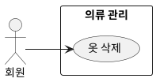

## 개요
회원이 옷장에서 옷을 골라 삭제한다.

## 요구사항
1. 회원은 옷장의 옷을 골라 삭제할 수 있다.
2. 등록에 실패한 옷을 지우는 것도 이 기능으로 처리한다. (등록 실패를 어떻게 보여 주고 다룰지는 [의류 등록](/use-cases/5/5-1) 참고.)

## 유스케이스 다이어그램

```plantuml
@startuml
left to right direction
skinparam packageStyle rectangle
skinparam shadowing false

actor "회원" as Member

rectangle "의류 관리" {
  usecase "옷 삭제" as Delete
}

Member --> Delete
@enduml
```
