## 개요
회원이 옷장에서 옷을 골라 삭제하는 기능이다. 등록에 실패한 옷이나 아직 처리 중인 옷도 삭제할 수 있다. 삭제는 회원의 확인을 거쳐 영구히 지운다.

## 요구사항
이 페이지의 요구사항은 **UC-DEL-01**(옷 삭제)을 실현한다.

### 삭제
| ID | 요구사항 |
| --- | --- |
| FR-DEL-01 | 회원은 옷장의 옷을 골라 삭제할 수 있다. |
| FR-DEL-02 | 등록에 실패한 옷이나 아직 처리 중인 옷도 삭제할 수 있다. |
| FR-DEL-03 | 삭제하기 전 시스템은 회원에게 삭제 여부를 확인받는다. |
| FR-DEL-04 | 회원이 확인하면 해당 옷과 그 이미지·속성을 영구히 삭제한다. 복구는 제공하지 않는다. |
| FR-DEL-05 | 삭제 대상이 처리 중이면 진행 중인 처리 작업을 취소 표시하고, 그 처리 결과는 저장하지 않는다. |

### 비기능 요구사항
| ID | 항목 | 요구사항 |
| --- | --- | --- |
| NFR-DEL-01 | 접근 권한 | 회원은 자신의 옷만 삭제할 수 있으며, 타인 소유 옷의 삭제 시도는 접근 거부로 처리한다. |

## 데이터
삭제 시 의류 레코드와 거기에 연결된 이미지(원본·누끼)를 함께 제거한다.

## 유스케이스 다이어그램

```plantuml
@startuml
left to right direction
skinparam packageStyle rectangle
skinparam shadowing false

actor "회원" as Member

rectangle "의류 관리" {
  usecase "옷 삭제" as Delete
}

Member --> Delete
@enduml
```

