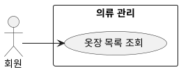

## 개요
회원이 자신의 옷장을 본다. 옷장은 등록한 옷 카드들의 목록이고, 각 카드는 처리 상태를 가진다. 이 목록과 상태 표시는 이 페이지가 맡는다.

## 요구사항
1. 회원은 자신의 옷장 옷 목록을 볼 수 있다.
2. 옷장은 등록한 옷 카드들의 목록으로 보여 준다. 각 카드는 상태를 가진다.
   - 처리 중: 서버가 아직 처리하고 있는 상태. 끝나기 전까지는 손댈 수 없게(편집 불가) 보여 준다.
   - 완료: 배경을 지운 이미지와 속성을 보여 준다.
3. 회원은 목록에서 옷을 골라 [수정](/use-cases/5/5-2/)하거나 [삭제](/use-cases/5/5-3)할 수 있다.

## 유스케이스 다이어그램

