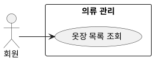

## 개요
회원이 자신의 옷장을 보는 기능이다. 옷장은 등록한 옷 카드들의 목록이고, 각 카드는 처리 상태와 검토 표시를 보여 준다. 지금은 등록한 옷 전체를 한 목록으로 보여 준다.

## 요구사항
이 페이지의 요구사항은 **UC-LIST-01**(옷장 목록 조회)을 실현한다.

### 목록 표시
| ID | 요구사항 |
| --- | --- |
| FR-LIST-01 | 회원은 자신의 옷장에 등록한 옷 목록을 볼 수 있다. |
| FR-LIST-02 | 옷장은 옷 카드들의 목록으로 보여 준다. 등록한 옷 전체를 한 목록으로 표시하며, 정렬·필터·검색은 두지 않는다. |
| FR-LIST-03 | 각 카드는 처리 상태를 보여 준다. 처리 중(아직 처리 중이며 편집 불가), 완료(배경을 지운 이미지와 속성 표시), 실패(재시도 버튼 표시). |
| FR-LIST-04 | 완료된 옷 중 회원이 아직 검토하지 않은 옷에는 "신규" 표시를 보여 준다. |
| FR-LIST-05 | 옷이 하나도 없으면 빈 옷장 안내와 함께 등록을 권한다. |

### 목록에서의 동작
| ID | 요구사항 |
| --- | --- |
| FR-LIST-06 | 회원은 목록에서 옷을 골라 [의류 수정](/closet-fairy-diagrams/use-cases/5/5-2)하거나 [의류 삭제](/closet-fairy-diagrams/use-cases/5/5-3)할 수 있다. |
| FR-LIST-07 | 회원은 실패한 옷의 카드에서 재시도할 수 있다. (재시도 동작은 [의류 등록](/closet-fairy-diagrams/use-cases/5/5-1) 참고) |

### 비기능 요구사항
| ID | 항목 | 요구사항 |
| --- | --- | --- |
| NFR-LIST-01 | 접근 권한 | 회원은 자신의 옷장만 조회한다. |
| NFR-LIST-02 | 실시간 갱신 | 처리 중인 옷의 상태는 약 1초 간격으로 갱신되어, 끝난 옷부터 완료 또는 실패로 바뀐다. |

## 데이터
조회는 의류 레코드의 처리 상태, 이미지, 속성, 검토 표시를 읽어 표시한다.

## 유스케이스 다이어그램

