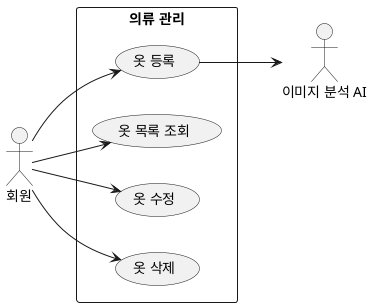

## 개요
회원이 자신의 옷장에 옷을 등록하고, 목록으로 조회하고, 수정하고, 삭제하는 영역이다. 모든 절차는 회원만 할 수 있다.

## 요구사항
의류의 등록, 조회, 수정, 삭제는 모두 회원만 할 수 있다. 각 기능의 세부 요구사항은 해당 하위 페이지에 적는다.

- 등록: 옷을 옷장에 등록한다(촬영·갤러리, 서버 비동기 처리). [의류 등록](/closet-fairy-diagrams/use-cases/5/5-1)
- 조회: 옷장의 옷 목록을 조회한다. [의류 목록 조회](/closet-fairy-diagrams/use-cases/5/5-4)
- 수정: 등록된 옷의 이미지나 속성을 수정한다. [의류 수정](/closet-fairy-diagrams/use-cases/5/5-2/)
- 삭제: 옷장에서 옷을 삭제한다. [의류 삭제](/closet-fairy-diagrams/use-cases/5/5-3)

## 유스케이스 다이어그램

## 정해야 하는 논의사항
지금 확정된 등록 방식은 직접 촬영뿐이다. 이미 찍어 둔 사진이 있다면 갤러리에서 여러 장을 한 번에 가져오는 방식도 함께 제공하면 좋겠다. 사실상 이 방식도 도입될 가능성이 높지만 아직 확정되지 않아 추후 결정이 필요하다.
