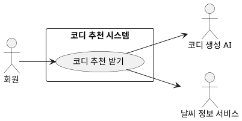

## 개요
회원이 그날의 상황과 외출 일정을 알려 주면, 시스템이 회원의 옷장과 취향, 날씨를 바탕으로 코디 여러 벌을 만들어 추천한다. 추천 결과에는 코디마다 추천 이유 설명과 날씨 관련 주의 안내가 함께 제공된다. 코디를 만드는 일은 코디 생성 AI가 맡고, 날씨 값은 외부 날씨 정보 서비스에서 받아 온다.

## 요구사항

### 회원이 입력하는 것
1. 회원은 코디 추천을 요청할 수 있다. 요청할 때 상황(예: 출근, 데이트, 결혼식 하객)과 외출 시간대, 외출부터 귀가까지의 일정을 함께 알려 준다.
2. 추천에는 회원의 취향 정보(추위·더위 민감도, 연령대, 성별, 선호 스타일)가 반영된다. 이 취향 정보는 [개인 설정](/closet-fairy-diagrams/use-cases/3)에서 관리한 값을 쓴다.
3. 추천 대상이 되는 옷은 회원이 [의류 관리](/closet-fairy-diagrams/use-cases/5)에서 등록한 옷이다.

### 추천을 만드는 과정
4. 시스템은 외부 날씨 정보 서비스에서 현재와 시간대별 기온, 강수, 계절 정보를 받아 온다.
5. 받아 온 날씨를 기준으로 지금 입기 어려운 옷을 먼저 추천 후보에서 뺀다. 예를 들어 기온이 28도 이상이면 패딩이나 코트 같은 두꺼운 겉옷을 빼고, 체감 기온이 15도 이하이면 겉옷을 반드시 포함한다. 한여름에는 두꺼운 니트를, 한겨울에는 민소매나 얇은 옷을 뺀다.
6. 남은 옷과 회원의 취향·상황을 코디 생성 AI에 전달해 코디를 만든다. 이때 회원이 실제로 가진 옷만 쓰고, 가지고 있지 않은 옷을 지어내지 않는다.
7. 서로 겹치지 않는 코디를 3벌에서 4벌까지 만든다. 회원의 선호 안에서 색 조합과 분위기에 변화를 줘 선택지를 다양하게 한다.

### 추천을 검토하는 과정
8. 만든 코디에 회원의 옷장에 없는 옷이 섞이지 않았는지 확인한다. 없는 옷이 들어간 코디는 버린다.
9. 착용이 어색하거나 상황에 맞지 않는 코디(예: 속옷 없이 겉옷만 입기, 상황과 동떨어진 차림)를 검토용 AI로 다시 살핀다.
10. 검토를 통과하지 못한 코디는 빼고, 남은 코디가 3벌에 못 미치면 부족한 이유를 담아 다시 만든다. 다시 만드는 일은 최대 2번까지 한다.

### 회원에게 함께 보여 주는 것
11. 코디마다 추천 이유를 회원이 읽기 편한 문장으로 함께 보여 준다. 기온과 상황에 어떻게 맞는지, 회원의 선호가 어떻게 반영됐는지를 담는다.
12. 외출부터 귀가까지의 기온 변화나 일교차, 비·미세먼지 같은 위험 요인이 있으면 대처 방법을 안내한다. 예를 들어 저녁에 기온이 크게 떨어지면 얇은 겉옷을 챙기라고, 비 예보가 있으면 우산과 방수 신발을 권한다. 안내는 회원의 추위·더위 민감도를 반영한다.

### 옷장이 부족할 때
13. 회원의 보유 옷이 너무 적거나(예: 5벌 미만) 상의·하의·신발 중 빠진 분류가 있어 정상적인 코디를 만들 수 없으면, 기본 의류 모음으로 대신 추천을 구성한다.
14. 이때 화면에서 회원이 가진 옷과 새로 추천하는 옷을 구분해 보여 주고, 옷장이 비어 기본 의류 위주로 추천했다는 안내와 함께 옷 등록을 권한다.

## 유스케이스 다이어그램

