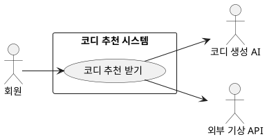

## 개요
회원이 보유한 옷장과 실시간 날씨, 상황(TPO), 개인 선호를 종합해 개인 맞춤 코디를 추천받는 기능이다. 시스템은 날씨·TPO로 부적합 의류를 먼저 걸러내고(룰 전처리), 선호 점수를 반영해 코디 생성 AI가 3\~4벌의 코디 후보와 추천 사유를 만든 뒤, 2단계 검증을 거쳐 결과를 보여 준다. 옷장이 부족하면 에센셜 의류로 보완한다. 추천 결과에 대한 자연어 정정은 [피드백 재추천 받기](/closet-fairy-diagrams/use-cases/6/6-2)에서 다룬다.

## 요구사항
이 페이지의 요구사항은 **UC-REC-01**(코디 추천 받기)을 실현한다.

### 데이터 전처리 (룰 필터링)
| ID | 요구사항 |
| --- | --- |
| FR-REC-01 | 시스템은 추천 요청 시 사용자 위치를 기반으로 외부 기상 API에서 현재 온도·날씨·시간대별 변화를 실시간 수집한다. |
| FR-REC-02 | 시스템은 수집한 환경 데이터로 룰 기반 필터링을 수행해 부적합 의류를 추천 후보에서 제거한다. (기온 28도 이상 패딩·두꺼운 아우터 제거, 체감 15도 이하 아우터 우선, 강수 시 방수 우선, 여름철 두꺼운 니트 제거) |
| FR-REC-03 | 시스템은 TPO(데이트·출근·결혼식 하객·운동 등)를 코디 생성 입력에 자연어로 전달해 환경 정보와 조합한다. |
| FR-REC-04 | 시스템은 사용자 선호 스타일에 따라 필터링 우선순위를 보조적으로 조정한다. (예: 미니멀 선호 시 과한 패턴 의류 우선순위 하향) |

### 다중 코디 생성
| ID | 요구사항 |
| --- | --- |
| FR-REC-05 | 시스템은 사용자 선호 점수에서 상위 항목을 추출해 선호·기피로 분류하고, 이를 코디 생성 입력에 반영한다. |
| FR-REC-06 | 코디 생성 AI는 서로 독립적인 코디 세트를 3\~4벌 동시에 생성한다. 각 세트는 아우터·상의·하의·신발·양말·악세서리 등 착용 아이템 목록을 포함한다. |
| FR-REC-07 | 시스템은 각 코디 세트에 날씨·체감온도·TPO 적합성과 선호 반영 근거를 담은 자연어 추천 사유를 함께 생성한다. |
| FR-REC-08 | 3\~4벌 중 2\~3벌은 선호 점수가 높은 상위 스타일을 활용해 실패 확률이 낮은 코디를 구성하고, 1벌은 최근 30일 내 미추천 또는 저선호 스타일(날씨·TPO 충족)을 탐색해 구성한다. 기피(음수 점수) 스타일은 탐색에서 제외한다. |
| FR-REC-09 | 회원은 코디를 선택·거절하거나 자연어로 수정을 요청할 수 있다. 수정 요청 처리는 [피드백 재추천 받기](/closet-fairy-diagrams/use-cases/6/6-2)에서 다룬다. |

### 에센셜 의류 보완
| ID | 요구사항 |
| --- | --- |
| FR-REC-10 | 시스템은 등록 의류가 5개 미만이거나 필수 카테고리(상의·하의·신발) 중 하나라도 미등록이면 '의류 부족 상태'로 판정한다. |
| FR-REC-11 | 의류 부족 상태에서는 에센셜 의류(범용 기본 아이템)의 활용 비중을 80% 이상으로 올려 코디를 구성한다. |
| FR-REC-12 | 부족 상태가 아니어도 특정 TPO(결혼식 하객·면접 등)에 필요한 아이템이 옷장에 없으면 에센셜 의류를 보조로 추가 제안한다. |
| FR-REC-13 | 추천 결과에서 보유 의류와 에센셜 추가 추천 의류를 시각적으로 구분해 표시한다. |
| FR-REC-14 | 의류 부족 상태에서는 추가 등록을 유도하는 안내 문구를 노출한다. |

### 2단계 검증과 재생성
| ID | 요구사항 |
| --- | --- |
| FR-REC-15 | 시스템은 생성된 코디에 1차 규칙 검증을 한다. 상의·아우터 누락, 신발 누락, 동일 카테고리 중복, 계절 역행(예: 28도 이상 패딩)을 검사하고, 실패하면 즉시 재생성한다. |
| FR-REC-16 | 1차를 통과한 코디는 2차 AI 리뷰어 검증을 거친다. TPO 적합성·스타일 일관성·색상 조화·선호 반영을 평가해 통과 여부와 사유를 판정한다. |
| FR-REC-17 | 2차 검증 실패 시 실패 사유를 반영해 재생성하며, 재생성은 최대 2회까지 한다. 2회 연속 실패하면 에센셜 기반 기본 코디를 대체 출력해 서비스가 끊기지 않게 한다. |
| FR-REC-18 | 검증·재생성 동안 화면에는 로딩 표시를 유지해 화면 멈춤이 없게 한다. |

### 선호 점수
| ID | 요구사항 |
| --- | --- |
| FR-REC-19 | 시스템은 회원의 코디 선택·거절과 정정 요청을 속성별 누적 선호 점수에 반영한다. 갱신값은 현재 설정값이며 외부 설정으로 분리한다: 선택 +3, 거절 -1, 정정 요청 ±2, 점수 범위 -15\~+30, 월 1회 감쇠 ×0.8. |

### 비기능 요구사항
| ID | 항목 | 요구사항 |
| --- | --- | --- |
| NFR-REC-01 | 가용성 | 추천 코어 API 장애 시 에러를 그대로 노출하지 않고 점검 안내 페이지로 안전하게 전환한다. |
| NFR-REC-02 | 외부 장애 대응 | 기상 API 응답 실패 시 마지막 수신값 또는 기본값(계절 평균 기온)으로 진행하고, 날씨 데이터 부재를 사용자에게 안내한다. |
| NFR-REC-03 | 이력 무결성 | 추천 완료 시 이력 저장은 원자적으로 처리하고, 실패하면 재시도로 누락을 막는다. |
| NFR-REC-04 | 데이터 보존 | 옷장 이미지·메타데이터를 자동 백업하고, 선호 점수 테이블은 주 1회 스냅샷 백업한다. |
| NFR-REC-05 | 보안 | 민감 정보와 옷장 원본 이미지는 저장 시 암호화(AES-256 등)하고, 클라이언트·서버 통신은 HTTPS(TLS 1.3 이상)로 보호한다. |
| NFR-REC-06 | 사용성 | 다양한 기기에서 반응형 화면을 제공하고, 추천 결과는 아이템 이미지·스타일 태그·추천 사유를 함께 보여 한눈에 파악되게 한다. |
| NFR-REC-07 | 유지보수성 | 점수 상수·임계치·감쇠 계수, 룰 필터링 규칙, 코디 생성·검증 프롬프트는 코드에 하드코딩하지 않고 외부 설정·버전 관리로 분리해 코드 변경 없이 조정·개선할 수 있게 한다. |
| NFR-REC-08 | 법적 준수 | 개인정보보호법을 준수하고, 가입·업로드 시 동의 절차를 두며, 탈퇴 시 선호 데이터·이미지를 지체 없이 영구 삭제한다. |

## 데이터
- **선호 점수(스코어보드)**: 스타일·색상 속성별 선호·기피 점수. 추천에 반영되고 피드백으로 갱신된다.
- **에센셜 의류 DB**: 범용 기본 아이템(화이트 셔츠·블랙 슬랙스·베이직 데님·화이트 스니커즈 등).
- **룰 딕셔너리**: 기온·날씨 조건별 의류 필터링 규칙.
- **추천 이력**: 추천 완료 기록. 원자적으로 저장한다.

## 외부 인터페이스
- **외부 기상 Open API (외부, 2차 액터)**: 위치 기반 실시간 날씨·기온을 제공한다. 응답 실패 시 기본값으로 대체한다.
- **코디 생성 AI / AI 리뷰어 (외부, 2차 액터)**: 코디를 생성하고 2차 검증을 수행한다.

## 유스케이스 다이어그램

## 정해야 하는 논의사항
추천 응답 시간 목표는 아직 확정되지 않았다. 자료 2에서 제안된 값(p95 평균 7초, 최대 10초)을 출발점으로 추후 정한다.
