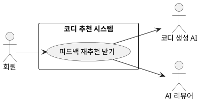

## 개요
회원이 추천받은 코디가 마음에 들지 않을 때, 화면에서 자연어로 정정을 요청하면 그 내용을 반영해 같은 자리에서 코디를 다시 추천하는 기능이다. [코디 추천 받기](/closet-fairy-diagrams/use-cases/6/6-1)를 한 번 마친 뒤 이어서 쓰는 기능이며, 같은 추천 세션 안에서 횟수 제한 없이 반복할 수 있다. 정정 요청의 의도 파악과 코디 재생성은 외부 AI가 맡는다.

## 요구사항
이 페이지의 요구사항은 **UC-REF-01**(피드백 재추천 받기)을 실현한다.

### 정정 요청 입력
| ID | 요구사항 |
| --- | --- |
| FR-REF-01 | 회원은 추천 화면에서 자연어로 정정 요청을 입력할 수 있다. (예: "좀 더 캐주얼하게", "검정색 옷 비율 줄여 줘", "덜 더워 보이게") |
| FR-REF-02 | 시스템은 정정 요청이 최대 길이(300자)를 넘지 않는지 확인한다. 초과 시 처리는 `EX-REF-01`을 따른다. 최대 길이는 외부 설정값으로 두어 조정할 수 있다. |
| FR-REF-03 | 시스템은 정정 요청에서 유해 입력을 검사한다. 감지 시 처리는 `EX-REF-02`를 따른다. |

### 의도 파악
| ID | 요구사항 |
| --- | --- |
| FR-REF-04 | 시스템은 정정 요청 문장을 LLM으로 속성 단위로 분해하여 바꿀 대상과 의도를 파악한다. 속성 요청(스타일·색상·재질)은 선호·기피로, 카테고리 교체 요청은 해당 카테고리 변경으로, 체감 관련 요청은 환경 기준 조정으로 해석한다. |
| FR-REF-05 | 의도 파악 결과는 아래 형태의 JSON으로 반환된다. 결과가 비어 있거나 신뢰도가 낮은 경우 처리는 `EX-REF-07`을 따른다. |
| FR-REF-06 | 정정 요청이 상충하는 경우(예: "더 캐주얼하고 더 포멀하게") 마지막 문장의 의도를 우선으로 해석한다. |

의도 파악 결과 JSON 예시:

```json
{"disliked":["black"],"preferred":["denim"],"category_change":{"bottom":"denim_pants"},"env_adjust":{"feels_like":-3}}
```

### 점수 반영과 추천 알고리즘
| ID | 요구사항 |
| --- | --- |
| FR-REF-07 | 시스템은 파악한 기피·선호 속성을 누적 선호 점수에 반영한다. 정정 요청은 완전 거절이 아니라 부분 수정 요청으로 간주하며, 반영 규칙과 점수 범위는 [코디 추천 받기](/closet-fairy-diagrams/use-cases/6/6-1) `FR-REC-19`를 따른다(정정 요청은 -1). |
| FR-REF-08 | 파악한 기피·선호 속성은 이번 추천 세션에 즉시 반영한다. 세션 즉시 반영은 누적 점수보다 우선하며, 다음 추천이 시작되면 초기화된다. |
| FR-REF-09 | 시스템은 갱신된 선호 점수 저장소에서 선호·기피 속성을 조회하여 코디 생성 입력에 포함한다. 선호·기피 판정 기준은 [코디 추천 받기](/closet-fairy-diagrams/use-cases/6/6-1)의 `FR-REC-05`(선호 추출)와 `FR-REC-21`(분류 기준)을 따른다. 이때도 세션 즉시 반영 항목이 누적 점수보다 우선한다. |
| FR-REF-10 | 재생성 시 코디 구성은 선호 스타일을 활용한 코디 2\~3벌과, 최근 30일 동안 추천되지 않았거나 저선호인 스타일을 활용한 탐색 코디 1벌로 구성한다. 저선호·기피 기준은 [코디 추천 받기](/closet-fairy-diagrams/use-cases/6/6-1)의 `FR-REC-08`·`FR-REC-21`을 따르며, 기피 스타일은 탐색에서도 제외한다. 세션 기피 속성은 선호 기반 코디에서는 우선순위를 낮추고, 탐색 코디에서는 완전히 제외한다. |
| FR-REF-11 | 환경 기준 조정 요청(예: "덜 더워 보이게")은 이번 세션에만 적용하는 항목으로 처리한다. 조정 단위는 외부 설정값으로 관리하며, 다음 추천이 시작되면 초기화된다. 누적 선호 점수에는 반영하지 않는다. |

### 재생성과 검증
| ID | 요구사항 |
| --- | --- |
| FR-REF-12 | 코디 생성 AI는 파악한 조건과 선호 정보가 반영된 입력으로 코디를 다시 만든다. 생성 코디 구성은 `FR-REF-10`을 따른다. |
| FR-REF-13 | 재생성된 코디는 [코디 추천 받기](/closet-fairy-diagrams/use-cases/6/6-1)와 동일한 2단계 검증(`FR-REC-15`·`FR-REC-16`)을 거친다. |
| FR-REF-14 | 검증에 실패하면 실패 사유를 반영해 다시 만든다. 재생성 횟수 한도는 [코디 추천 받기](/closet-fairy-diagrams/use-cases/6/6-1)를 따라 1차 검증 실패와 2차 검증 실패를 **각각 2회씩** 센다. 한도 초과 시 처리는 `EX-REF-05`가 `FR-REC-17`을 대체한다. |
| FR-REF-15 | 검증을 통과한 코디로 기존 추천 화면을 갱신한다. 코디 결과는 의류 아이템 이미지·스타일 태그·추천 사유를 함께 표시하며, 보유 의류와 에센셜 의류를 구분해 보여 준다. 재생성 중에는 로딩 표시를 유지해 화면 멈춤이 없게 한다. |
| FR-REF-16 | 재추천이 최종 실패하면(`EX-REF-05`) 해당 정정으로 반영된 누적 점수(-1)와 세션 즉시 반영 항목을 되돌린다. 원하는 변화를 얻지 못했는데 점수만 깎이는 상황을 막는다. |
| FR-REF-17 | 회원은 재추천 결과를 본 뒤에도 같은 세션 안에서 횟수 제한 없이 정정 요청을 반복할 수 있다. |

### 비기능 요구사항
| ID | 항목 | 요구사항 |
| --- | --- | --- |
| NFR-REF-01 | 응답 시간 | 정정 요청 후 재추천 결과는 의도 파악에 걸리는 시간까지 포함한 총 소요 시간 기준으로 [코디 추천 받기](/closet-fairy-diagrams/use-cases/6/6-1)와 동일한 응답 시간 목표 안에 표시한다. |
| NFR-REF-02 | 데이터 일관성 | 속성 점수 반영은 실시간으로 선호 점수 저장소에 반영한다. 재추천 최종 실패 시 해당 정정 점수는 되돌린다. |
| NFR-REF-03 | 세션 관리 | 추천 세션은 새로운 코디 추천 요청이 시작될 때 초기화된다. 세션 즉시 반영 항목과 환경 기준 조정값은 세션이 끝나면 사라진다. |

### 예외 처리
| 예외 ID | 발생 조건 | 처리 방법 |
| --- | --- | --- |
| EX-REF-01 | 입력 길이 제한(300자) 초과 | 안내 메시지 표시 후 다시 입력받음 |
| EX-REF-02 | 유해 입력 감지(욕설·성적·차별 표현, 프롬프트 인젝션) | 차단 안내 메시지 표시 후 다시 입력받음 |
| EX-REF-03 | 1차 검증 실패 | 실패 사유 포함해 즉시 재생성(최대 2회) |
| EX-REF-04 | 2차 검증 실패 | 실패 사유를 반영해 재생성(1차와 별개로 최대 2회) |
| EX-REF-05 | 재생성 2회 초과 후에도 실패 | 마지막 성공 추천 결과를 유지한다. 성공 결과가 없으면 에센셜 기반 기본 코디를 대체 출력한다. 해당 정정의 점수·세션 반영은 되돌린다. |
| EX-REF-06 | 코디 추천 받기 미완료 상태에서 요청 | 화면에서 정정 요청 기능을 비활성화해 요청 자체를 막고, 우회 요청이 서버에 도달하면 거부한다. |
| EX-REF-07 | 의도 파악 실패 또는 저신뢰(빈 문자열, 무의미 입력, 코디와 무관한 문장, 속성으로 분해할 수 없는 추상 요청) | "요청을 이해하지 못했습니다. 다시 말씀해 주세요" 안내 후 다시 입력받는다. 재생성을 시작하지 않는다. |

## 데이터
- **누적 선호 점수**: 스타일·색상 등 속성별 선호·기피 점수. 정정 요청으로 갱신되고 재추천에 반영된다. 재추천 최종 실패 시 해당 정정 점수는 되돌린다.
- **세션 즉시 반영 항목**: 이번 추천 세션에만 적용하는 기피·선호 속성. 누적 점수와 분리해 다루며, 세션이 끝나면 사라진다.
- **환경 기준 조정값**: 이번 세션에만 적용하는 체감온도 등 환경 기준 조정. 누적 점수에 반영하지 않으며 세션이 끝나면 사라진다.
- **마지막 성공 추천 결과**: 가장 최근에 검증을 통과한 추천 결과 1건. 재추천 실패 시 되돌릴 기준으로 쓴다.

## 외부 인터페이스
- **코디 생성 AI (외부, 2차 액터)**: 정정 요청의 의도 파악과 코디 재생성을 담당한다.
- **AI 리뷰어 (외부, 2차 액터)**: 재생성된 코디의 2차 검증을 수행한다. 세부는 [코디 추천 받기](/closet-fairy-diagrams/use-cases/6/6-1)에서 다룬다.

## 유스케이스 다이어그램

