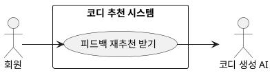

## 개요
회원이 추천받은 코디가 마음에 들지 않을 때, 화면에서 자연어로 정정을 요청하면 그 내용을 반영해 같은 자리에서 코디를 다시 추천하는 기능이다. [코디 추천 받기](/closet-fairy-diagrams/use-cases/6/6-1)를 한 번 마친 뒤 이어서 쓰는 기능이며, 같은 추천 세션 안에서 횟수 제한 없이 반복할 수 있다. 다시 만드는 일은 코디 생성 AI가 맡는다.

## 요구사항
이 페이지의 요구사항은 **UC-REF-01**(피드백 재추천 받기)을 실현한다.

### 정정 요청 입력
| ID | 요구사항 |
| --- | --- |
| FR-REF-01 | 회원은 추천 화면에서 자연어로 정정 요청을 입력할 수 있다. (예: "좀 더 캐주얼하게", "검정색 옷 비율 줄여 줘", "덜 더워 보이게") |
| FR-REF-02 | 시스템은 정정 요청의 길이 제한을 확인한다. 초과 시 처리는 `EX-REF-01`을 따른다. |
| FR-REF-03 | 시스템은 정정 요청에서 유해 입력을 검사한다. 감지 시 처리는 `EX-REF-02`를 따른다. |

### 의도 파악과 점수 반영
| ID | 요구사항 |
| --- | --- |
| FR-REF-04 | 시스템은 정정 요청 문장을 속성 단위로 분해하여 바꿀 대상과 의도를 파악한다. 스타일·색상·재질 등은 선호·기피로, 체감 관련 요청은 환경 기준 조정으로 해석한다. (예: "슬랙스 대신 청바지로" → black(색상) 기피, denim(재질) 선호 / "덜 더워 보이게" → 체감온도 기준 하향) |
| FR-REF-05 | 시스템은 파악한 기피·선호 속성을 누적 선호 점수에 반영한다. 반영 규칙과 점수 범위는 [코디 추천 받기](/closet-fairy-diagrams/use-cases/6/6-1) FR-REC-19를 따른다(정정 요청은 ±2). |
| FR-REF-06 | 파악한 기피 속성은 이번 추천 세션에 즉시 반영하여 재생성 시 우선순위를 낮춘다. 이 즉시 반영은 누적 점수 반영과 분리하여 처리한다. |

### 재생성과 검증
| ID | 요구사항 |
| --- | --- |
| FR-REF-07 | 코디 생성 AI는 정정으로 반영된 조건으로 코디를 다시 만든다. 생성 코디 구성(벌 수, 탐색용 코디 포함)은 [코디 추천 받기](/closet-fairy-diagrams/use-cases/6/6-1)의 `FR-REC-06`·`FR-REC-08`을 따른다. |
| FR-REF-08 | 재생성된 코디는 [코디 추천 받기](/closet-fairy-diagrams/use-cases/6/6-1)와 동일한 2단계 검증(`FR-REC-15`·`FR-REC-16`)을 거친다. |
| FR-REF-09 | 검증에 실패하면 실패 사유를 반영해 다시 만든다. 재생성 횟수 한도는 [코디 추천 받기](/closet-fairy-diagrams/use-cases/6/6-1) `FR-REC-17`을 따르며, 한도 초과 후에도 통과 코디가 없을 때의 처리는 `EX-REF-05`를 따른다. |
| FR-REF-10 | 검증을 통과한 코디로 기존 추천 화면을 갱신한다. |
| FR-REF-11 | 회원은 재추천 결과를 본 뒤에도 같은 세션 안에서 횟수 제한 없이 정정 요청을 반복할 수 있다. |

### 비기능 요구사항
| ID | 항목 | 요구사항 |
| --- | --- | --- |
| NFR-REF-01 | 응답 시간 | 정정 요청 후 재추천 결과는 코디 추천 받기와 동일한 응답 시간 목표 안에 표시한다. |
| NFR-REF-02 | 데이터 일관성 | 속성 점수 반영은 실시간으로 선호 점수 저장소에 반영한다. |

### 예외 처리
| 예외 ID | 발생 조건 | 처리 방법 |
| --- | --- | --- |
| EX-REF-01 | 입력 길이 제한 초과 | 안내 메시지 표시 후 다시 입력받음 |
| EX-REF-02 | 유해 입력 감지 | 차단 안내 메시지 표시 후 다시 입력받음 |
| EX-REF-03 | 1차 검증 실패 | 실패 사유 포함해 즉시 재생성 |
| EX-REF-04 | 2차 검증 실패 | 실패 사유를 반영해 재생성 |
| EX-REF-05 | 재생성 2회 초과 후에도 실패 | 통과한 코디만 표시, 통과 코디가 없으면 오류 안내 후 기존 결과 유지 |
| EX-REF-06 | 코디 추천 받기 미완료 상태에서 요청 | 정정 요청 기능 비활성화 유지 |

## 데이터
- **누적 선호 점수**: 스타일·색상 등 속성별 선호·기피 점수. 정정 요청으로 갱신되고 재추천에 반영된다.
- **세션 즉시 반영 항목**: 이번 추천 세션에만 적용하는 기피 속성. 누적 점수와 분리해서 다룬다.

## 외부 인터페이스
- **코디 생성 AI (외부, 2차 액터)**: 반영된 조건을 받아 코디를 다시 생성한다. 생성과 검증(AI 리뷰어)의 세부는 [코디 추천 받기](/closet-fairy-diagrams/use-cases/6/6-1)에서 다룬다.

## 유스케이스 다이어그램

