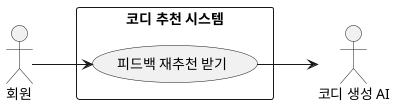

## 개요
회원이 추천받은 코디가 마음에 들지 않을 때, 화면에서 말로 정정을 요청하면 그 내용을 반영해 같은 자리에서 코디를 다시 추천하는 기능이다. 코디를 한 번 추천받은 뒤 이어서 하는 선택 기능이다. 다시 만드는 일은 코디 생성 AI가 맡는다.

## 요구사항

### 정정 요청
1. 회원은 추천 화면에서 말로 정정을 요청할 수 있다. 예를 들어 "좀 더 캐주얼하게", "검정색 옷 비율 줄여 줘", "덜 더워 보이게" 처럼 적는다.
2. 입력은 길이 제한을 확인하고, 해로운 입력이 들어오지 않도록 거른 뒤 처리한다.

### 요청 반영
3. 시스템은 요청 문장에서 바꿀 대상과 의도를 파악한다. 예를 들어 검정색을 줄여 달라고 하면 검정 계열의 비중을 낮추고, 덜 덥게 해 달라고 하면 더위 기준을 낮춘다.
4. 파악한 내용은 이번 추천에만 반영한다. 피하고 싶다고 한 항목은 우선순위를 낮춰 다음 추천에서 덜 나오게 한다.

### 다시 추천
5. 반영한 조건으로 코디를 3벌에서 4벌까지 다시 만들고, [코디 추천 받기](/use-cases/6/6-1)의 검토 과정을 똑같이 거친 뒤 화면을 갱신한다.
6. 정정 요청은 추천을 받은 뒤에 여러 번 이어서 할 수 있다.

## 유스케이스 다이어그램

