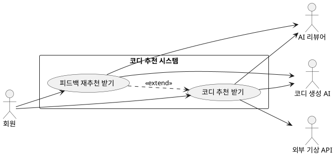

## 개요
회원이 자신의 옷장과 취향, 그날의 상황과 날씨에 맞춰 코디를 추천받는 영역이다. 추천 결과에는 코디 여러 벌과 함께 추천 이유 설명, 날씨 관련 주의 안내가 같이 제공된다. 결과가 마음에 들지 않으면 회원이 말로 정정을 요청해 다시 추천받을 수 있다.

## 요구사항
이 영역은 다음 두 기능으로 이루어진다. 세부 요구사항은 각 하위 페이지에 적는다.

- 코디 추천 받기: 상황을 입력하면 코디 여러 벌과 설명·안내를 받는다. [코디 추천 받기](/closet-fairy-diagrams/use-cases/6/6-1)
- 피드백 재추천 받기: 추천 결과에 말로 정정을 요청해 다시 받는다. [피드백 재추천 받기](/closet-fairy-diagrams/use-cases/6/6-2)

추천에 쓰는 취향 정보(체질, 연령대, 성별, 선호 스타일)는 [개인 설정](/closet-fairy-diagrams/use-cases/3)에서 관리하고, 추천 대상이 되는 옷은 [의류 관리](/closet-fairy-diagrams/use-cases/5)에서 등록한 옷을 사용한다. 코디를 만드는 일은 코디 생성 AI가 맡고, 만들어진 코디는 AI 리뷰어가 한 번 더 검증한다. 날씨 값은 외부 기상 API에서 받아 온다.

## 유스케이스 다이어그램

