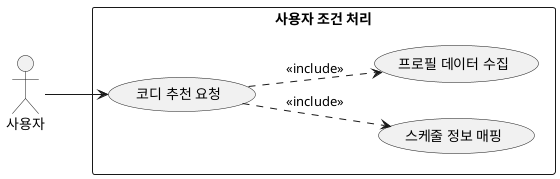

## 6.1 사용자 조건 처리

### 개요

사용자가 코디 추천을 요청할 때 입력한 기본 프로필, 성향 및 스케줄 정보를 시스템 인터페이스를 통해 수집하고 처리하는 기능이다.

### 요구사항

(Claude가 작성, 검토 필요)

1. 사용자는 성별, 연령대, 선호 스타일, 체질 정보를 기반으로 코디 추천을 요청할 수 있다.
2. 사용자는 외출 시간대 및 특정 상황(TPO) 정보를 시스템에 제공한다.
3. 입력된 데이터는 하위 룰 기반 필터링 및 LLM 컨텍스트의 파라미터로 변환된다.

### 유스케이스 다이어그램

