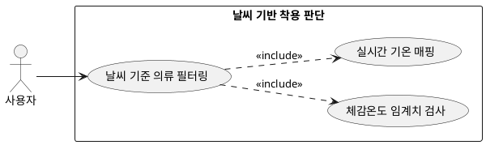

## 6.2.1 날씨를 기반으로 착용 가능 여부 판단

### 개요
실시간 기온 및 체감온도 수치를 기반으로 특정 의류 카테고리의 착용 가능 여부를 엄격하게 판정하는 기능이다.

### 요구사항

(Claude가 작성, 검토 필요)

1. 현재 기온이 28°C 이상일 경우 패딩, 코트 등 헤비 아우터 류를 후보군에서 차단한다.
2. 체감온도가 15°C 이하로 떨어질 경우 아우터 카테고리를 필수 추천 후보로 지정한다.

---

### 유스케이스 다이어그램
