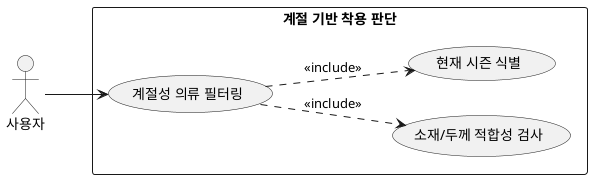

## 6.2.2 계절을 기반으로 착용 가능 여부 판단

### 개요
현재 날짜 기준의 계절성 요소를 분석하여 해당 계절의 범주를 벗어나는 소재 및 두께의 의류를 필터링하는 기능이다.

### 요구사항

(Claude가 작성, 검토 필요)

1. 현재 시스템 날짜를 기반으로 활성화된 계절(봄, 여름, 가을, 겨울) 속성을 식별한다.
2. 한여름에 두꺼운 니트류를 제거하고, 한겨울에 민소매나 얇은 린넨 소재 의류를 추천 후보에서 배제한다.

---

### 유스케이스 다이어그램
