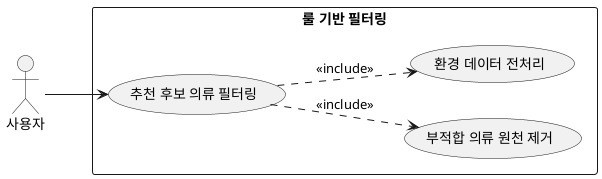

## 6.2 룰 기반 필터링

### 개요
AI가 코디 조합을 생성하기 전, 시스템 내부의 하드 규칙(Hard Rule)을 기반으로 현재 환경에 부적합한 의류를 백엔드 단에서 원천 필터링하는 전처리 기능이다.

### 요구사항

(Claude가 작성, 검토 필요)

1. 외부 API를 통해 수집된 날씨 및 계절 데이터를 가공한다.
2. 사전에 정의된 데이터 매트릭스를 기반으로 현재 기온 및 계절에 착용할 수 없는 의류군을 필터링한다.

---

### 유스케이스 다이어그램
