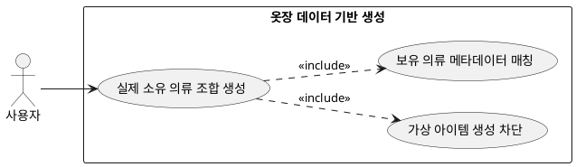

## 6.3.1 옷장 데이터 기반 코디 조합 생성

### 개요
유저가 직접 등록하고 시스템이 승인한 '실제 옷장 DB' 내부의 한정된 자원만을 조합하여 실착 가능한 룩을 완성하는 기능이다.

### 요구사항

(Claude가 작성, 검토 필요)

1. 프롬프트에 주입된 유저 옷장 메타데이터(색상, 카테고리) 이외의 가상 의류 생성을 금지하여 할루시네이션을 방지한다.
2. 사용자가 소유한 상의, 하의, 아우터, 신발 간의 조합 유효성을 검토하여 세트를 구성한다.

---

### 유스케이스 다이어그램
