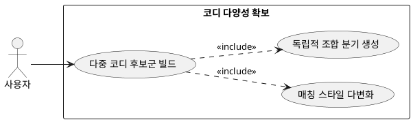

## 6.3.2 코디 다양성 확보 (3~4개 생성)

### 개요
유저에게 한 가지 제안만 강요하지 않고, 기호에 맞는 다양한 선택지를 부여하기 위해 멀티 스레드 혹은 반복 구조를 통해 복수의 코디셋을 빌드하는 기능이다.

### 요구사항

(Claude가 작성, 검토 필요)

1. 동일한 조건 컨텍스트 하에서 완전히 중복되지 않는 독립적인 코디 조합을 최소 3셋에서 최대 4셋까지 구성한다.
2. 캐주얼, 미니멀 등 유저 선호 범주 내에서 톤온톤, 톤인톤 등 매칭 스타일의 변화를 주어 다양성을 확보한다.

---

### 유스케이스 다이어그램
