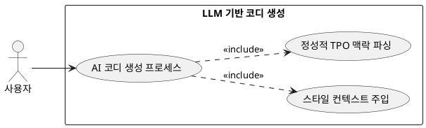

## 6.3 LLM 기반 코디 생성

### 개요
전처리 필터링이 완료된 의류 데이터와 유저 프로필 정보를 생성형 AI(LLM)에 전달하여, 정성적인 상황 맥락에 맞는 코디 후보군을 도출하는 핵심 기능이다.

### 요구사항

(Claude가 작성, 검토 필요)

1. 사용자의 데이터베이스에 저장된 실제 보유 의류 리스트를 프롬프트 컨텍스트로 전달한다.
2. 자연어 기반의 TPO 명령을 파싱하여 스타일 일관성을 가진 코디 세트를 생성하도록 지시한다.

---

### 유스케이스 다이어그램
