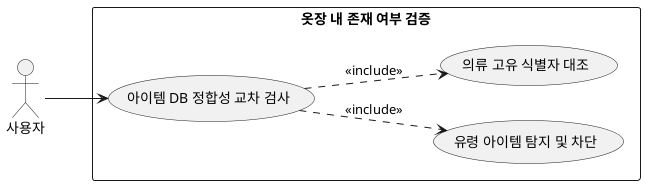

## 6.4.1 옷장 내 존재 여부 검증

### 개요
1차적으로 백엔드 서버단에서 AI가 조합한 의류 아이템의 고유 ID가 실제 유저의 옷장 DB 레코드와 상호 일치하는지 데이터 정합성을 하드 룰로 검사하는 기능이다.

### 요구사항

(Claude가 작성, 검토 필요)

1. 코디셋에 할당된 개별 의류의 메타명 혹은 ID를 유저의 실제 테이블 데이터와 교차 검증(If-Else)한다.
2. 옷장에 존재하지 않는 가상의 유령 아이템이 포함되었을 경우, 해당 코디 세트를 즉시 '실패' 처리한다.

---

### 유스케이스 다이어그램
