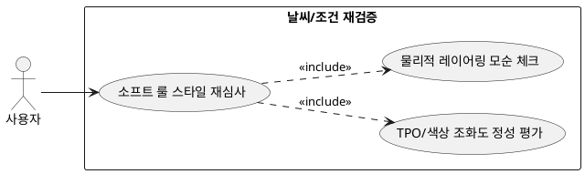

## 6.4.2 날씨/조건 재검증

### 개요
경량화된 별도의 LLM 패션 리뷰어(Fashion Reviewer) 소프트 룰 레이어를 작동시켜, 정성적인 매칭 밸런스(TPO 부합도, 레이어링 모순 여부 등)를 최종 재심사하는 기능이다.

### 요구사항

(Claude가 작성, 검토 필요)

1. "이너 없이 아우터만 추천"하는 등의 물리적 착용 모순 관계를 인공지능 시맨틱 단위로 체크한다.
2. 코드로 구현하기 어려운 TPO 매칭률 및 색상 조화도를 평가하여 합격/불합격(pass/false) 사유를 리턴받는다.

---

### 유스케이스 다이어그램
