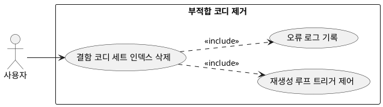

## 6.4.3 부적합 코디 제거

### 개요
앞선 1·2차 검증(Hard/Soft Rule)에서 불합격 판정을 받은 결함 코디 세트를 유저에게 제공될 최종 배열(Array) 데이터에서 영구 제외하는 기능이다.

### 요구사항

(Claude가 작성, 검토 필요)

1. 불합격된 코디 세트를 후보군에서 누락시키고, 결함의 원인 코드를 로그에 기록한다.
2. 제거로 인해 추천 코디 개수가 목표치(3~4개)에 미달할 시, 원인 피드백을 프롬프트에 동봉하여 코디 재생성 모듈로 리다이렉트한다(최대 2회).

---

### 유스케이스 다이어그램
