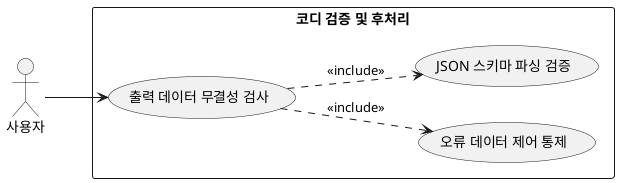

## 6.4 코디 검증 및 후처리

### 개요
LLM이 출력을 완료한 가공 데이터(JSON)를 유저 인터페이스에 뿌리기 전, 백엔드 엔진과 검증용 AI를 통해 오류를 도출하고 필터링하는 품질 관리 기능이다.

### 요구사항

(Claude가 작성, 검토 필요)

1. 생성된 코디 데이터가 사전에 정의된 JSON 스키마 규격을 충족하는지 파싱 검증을 수행한다.
2. 부적합 요소 발견 시 유저 화면 노출을 차단하고 자동 내부 재생성 루프를 제어한다.

---

### 유스케이스 다이어그램
