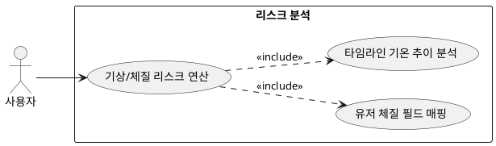

## 6.5 리스크 분석

### 개요

실시간 기상 스케줄 데이터와 유저 개인의 생리적 체질 정보를 동적으로 비교 연산하여 가벼운 야외 활동이나 출퇴근 시 발생 가능한 리스크 인자를 도출하는 기능이다.

### 요구사항

(Claude가 작성, 검토 필요)

1. 외출부터 귀가 시간까지의 타임라인별 기온 스펙트럼 변화 강도를 분석한다.
2. 유저 프로필에 저장된 추위/더위 민감도 필드 데이터를 가져와 매핑 연산한다.

### 유스케이스 다이어그램

