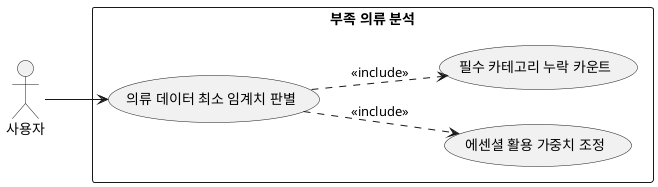

## 6.6.1 부족 의류 분석

### 개요
유저의 옷장 내 등록 의류 총 개수가 5개 미만이거나 필수 카테고리(상의/하의/신발) 중 어느 하나라도 누락되어 정상적인 코디 빌드가 불가능한 상태를 판별하는 기능이다.

### 요구사항

(Claude가 작성, 검토 필요)

1. 옷장 테이블의 카테고리별 Count 쿼리를 실행하여 필수 노드의 Null 여부를 확인한다.
2. 부족 데이터 상태가 확정되면 에센셜 의류 DB의 활용 가중치를 80% 이상으로 끌어올리도록 백엔드 변수를 조정한다.

---

### 유스케이스 다이어그램
