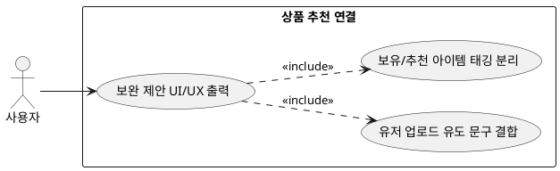

## 6.6.2 상품 추천 연결

### 개요
유저에게 코디를 출력할 때 본인 소유의 옷과 에센셜 DB에서 끌어온 가상 아이템을 인터페이스상에서 명확히 이원화하여 UI/UX 가이드를 발송하는 기능이다.

### 요구사항

(Claude가 작성, 검토 필요)

1. 출력 화면 단에 [사용자 보유 의류] 태그와 [추가 추천 의류] 태그를 시각적으로 분리 렌더링한다.
2. "아직 옷장이 비어 있어 에센셜 아이템 위주로 추천했어요!"라는 신규 유저 유도 안내 문구를 동적으로 출력 바디에 결합한다.

---

### 유스케이스 다이어그램
