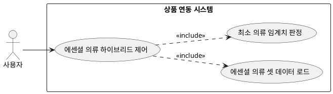

## 6.6 상품 연동

### 개요
사용자의 가용 의류 데이터 상태를 계량화하여 특정 TPO에 부합하는 최소 의류 조건 충족 여부를 확인하고 예외 케이스 발생 시 외부 연결 구조를 작동시키는 기능이다.

### 요구사항

(Claude가 작성, 검토 필요)

1. 사용자의 실제 보유 의류 개수가 하드웨어 최소 기준치에 도달하는지 분기문을 실행한다.
2. 데이터 공백 시 활용할 대체 에센셜 의류 데이터셋 명세를 메모리에 로드한다.

---

### 유스케이스 다이어그램
