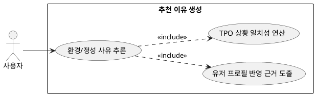

## 7.1.1 추천 이유 생성

### 개요
현재 기온, 요청된 TPO(결혼식, 데이트 등), 유저 고유의 취향 선호 점수판 데이터를 결합하여 코디가 성립된 객관적이고 주관적인 사유를 LLM을 통해 도출하는 기능이다.

### 요구사항

(Claude가 작성, 검토 필요)

1. "18도의 실내 환경에 적합", "결혼식 하객 분위기 매칭" 등 환경/정성적 조건과의 일치성을 추론한다.
2. 유저 프로필 내 상위 스타일 점수(예: 미니멀 선호)가 반영되었음을 서술하는 근거 데이터를 생성한다.

---

### 유스케이스 다이어그램
