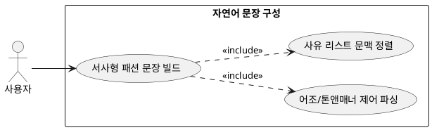

## 7.1.2 자연어 문장 구성

### 개요
LLM의 언어 생성 능력을 조율하여 파싱된 원천 사유 목록 데이터를 유저가 읽기 부드러운 다정하고 세련된 완성형 자연어 문장 체계로 가공하는 기능이다.

### 요구사항

(Claude가 작성, 검토 필요)

1. 파편화된 원천 근거 리스트 데이터를 입력으로 받아 유기적인 서사형 문장으로 정렬한다.
2. 딱딱한 시스템 메시지 어조를 지양하고 자연스러운 패션 어드바이저의 톤앤매너를 유지하도록 출력 토큰을 제어한다.

---

### 유스케이스 다이어그램
