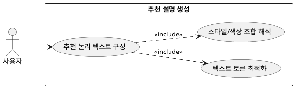

## 7.1 추천 설명 생성

### 개요
사용자가 도출된 스타일링에 심리적 만족감과 당위성을 느낄 수 있도록 코디 조합의 내부 가치와 논리적 연관성을 텍스트 아웃풋으로 구성하는 핵심 AI 기능이다.

### 요구사항

(Claude가 작성, 검토 필요)

1. 완성된 의류 컴포넌트들의 색상 조합(톤온톤 등)과 스타일적 지향점을 해석한다.
2. 유저 인터페이스에 부합하는 최적의 텍스트 토큰 구조로 변환을 명령한다.

---

### 유스케이스 다이어그램
