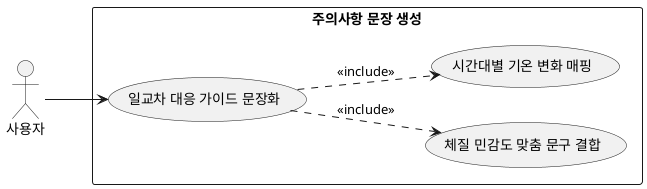

## 7.2.1 주의사항 문장 생성

### 개요
외출 시간과 귀가 시간 사이에 예정된 온도 변화 및 일교차 추이를 고려하여 유저가 겉옷을 지참해야 하거나 레이어링을 조절해야 하는 사유를 생성하는 기능이다.

### 요구사항

(Claude가 작성, 검토 필요)

1. "저녁 시간대 기온이 5도 이상 급격히 하락할 예정이니 얇은 가디건을 가방에 소지하세요"와 같은 다단 기온 대응 주의사항을 문장화한다.
2. 유저의 개인 체질 민감도 필드(더위/추위 취약성)를 문장 서두에 녹여내어 개인화된 주의 문구로 탈바꿈한다.

---

### 유스케이스 다이어그램
